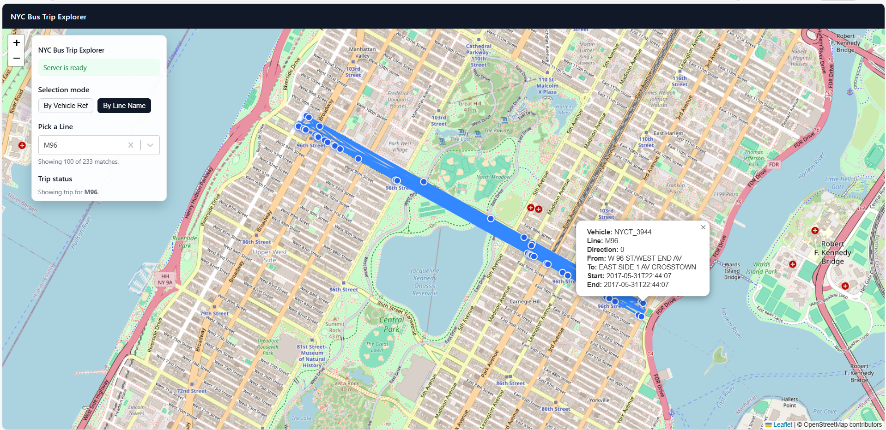

## NYC Bus Trip Explorer

A small React SPA that visualises NYC bus trips on an interactive map using GeoJSON data from a remote API.

The app:

- Checks if the backend “bus engine” is ready (cold starts are supported via a `/ready` endpoint).
- Loads available **vehicle references** and **published line names**.
- Lets you switch between:
  - **By Vehicle Ref** – pick a specific bus (e.g. `NYCT_6617`)
  - **By Line Name** – pick a route (e.g. `Bx2`)
- Fetches the corresponding trip GeoJSON and plots it on a Leaflet map (points + polylines).
- Shows detailed info when point/polyline is clicked.

### Tech stack

- Vite + React + TypeScript
- react-leaflet + Leaflet (map + GeoJSON rendering)
- Simple fetch-based API layer (no backend code in this repo)

### Running locally

```bash
npm install
npm run dev
```

### Screenshot
