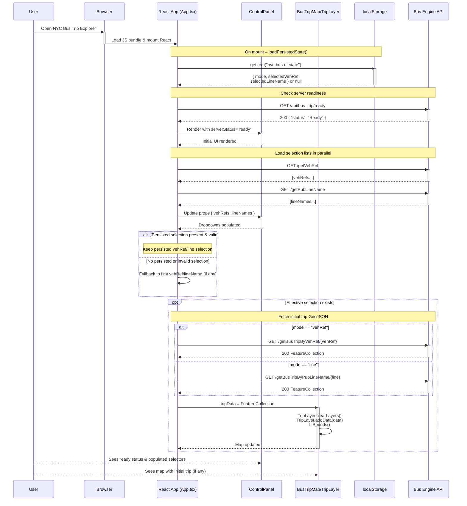
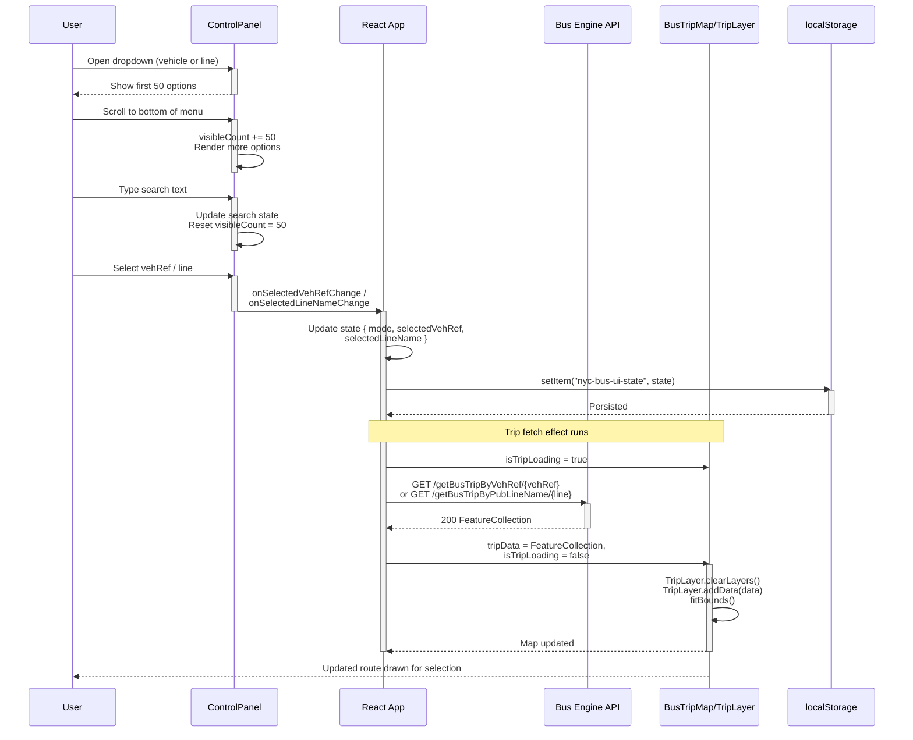
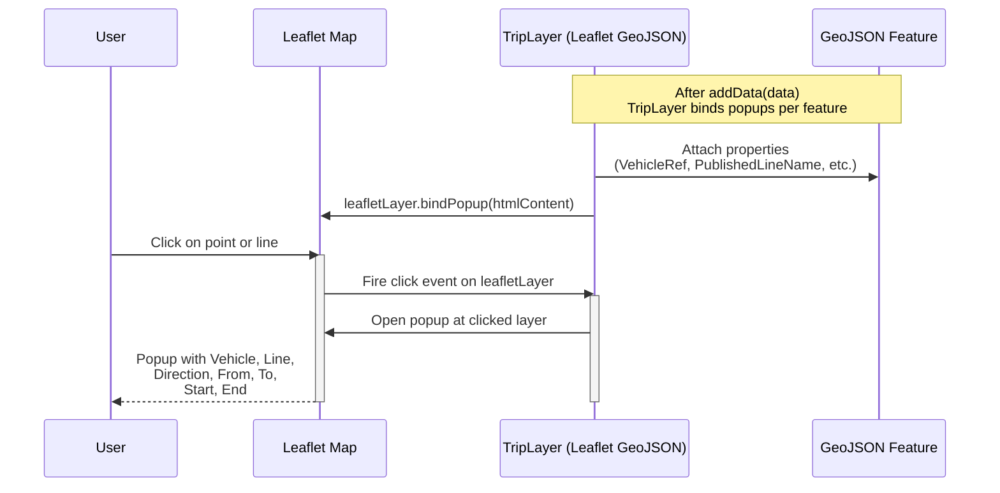

# Software Design
### App startup + initial data load

```mermaid
sequenceDiagram
    participant U as User
    participant B as Browser
    participant App as React App (App.tsx)
    participant CP as ControlPanel
    participant Map as BusTripMap/TripLayer
    participant LS as localStorage
    participant API as Bus Engine API

    U->>B: Open NYC Bus Trip Explorer
    activate B
    B->>App: Load JS bundle & mount React
    deactivate B

    Note over App,LS: On mount – loadPersistedState()

    App->>LS: getItem("nyc-bus-ui-state")
    activate LS
    LS-->>App: { mode, selectedVehRef,<br/>selectedLineName } or null
    deactivate LS

    Note over App,API: Check server readiness

    App->>API: GET /api/bus_trip/ready
    activate API
    API-->>App: 200 { "status": "Ready" }
    deactivate API

    App->>CP: Render with serverStatus="ready"
    activate CP
    CP-->>App: Initial UI rendered
    deactivate CP

    Note over App,API: Load selection lists in parallel

    App->>API: GET /getVehRef
    activate API
    API-->>App: [vehRefs...]
    deactivate API

    App->>API: GET /getPubLineName
    activate API
    API-->>App: [lineNames...]
    deactivate API

    App->>CP: Update props { vehRefs, lineNames }
    activate CP
    CP-->>App: Dropdowns populated
    deactivate CP

    alt Persisted selection present & valid
        Note over App: Keep persisted vehRef/line selection
    else No persisted or invalid selection
        App->>App: Fallback to first vehRef/lineName (if any)
    end

    opt Effective selection exists
        Note over App,API: Fetch initial trip GeoJSON

        alt mode == "vehRef"
            App->>API: GET /getBusTripByVehRef/{vehRef}
            activate API
            API-->>App: 200 FeatureCollection
            deactivate API
        else mode == "line"
            App->>API: GET /getBusTripByPubLineName/{line}
            activate API
            API-->>App: 200 FeatureCollection
            deactivate API
        end

        App->>Map: tripData = FeatureCollection
        activate Map
        Map->>Map: TripLayer.clearLayers()<br/>TripLayer.addData(data)<br/>fitBounds()
        Map-->>App: Map updated
        deactivate Map
    end

    U-->>CP: Sees ready status & populated selectors
    U-->>Map: Sees map with initial trip (if any)
```

### Selecting new VehRef/LineName

```mermaid
sequenceDiagram
    participant U as User
    participant CP as ControlPanel
    participant App as React App
    participant API as Bus Engine API
    participant Map as BusTripMap/TripLayer
    participant LS as localStorage

    U->>CP: Open dropdown (vehicle or line)
    activate CP
    CP-->>U: Show first 50 options
    deactivate CP

    U->>CP: Scroll to bottom of menu
    activate CP
    CP->>CP: visibleCount += 50<br/>Render more options
    deactivate CP

    U->>CP: Type search text
    activate CP
    CP->>CP: Update search state<br/>Reset visibleCount = 50
    deactivate CP

    U->>CP: Select vehRef / line
    activate CP
    CP->>App: onSelectedVehRefChange /<br/>onSelectedLineNameChange
    deactivate CP

    activate App
    App->>App: Update state { mode, selectedVehRef,<br/>selectedLineName }

    App->>LS: setItem("nyc-bus-ui-state", state)
    activate LS
    LS-->>App: Persisted
    deactivate LS

    Note over App,Map: Trip fetch effect runs

    App->>Map: isTripLoading = true
    App->>API: GET /getBusTripByVehRef/{vehRef}<br/>or GET /getBusTripByPubLineName/{line}
    activate API
    API-->>App: 200 FeatureCollection
    deactivate API

    App->>Map: tripData = FeatureCollection,<br/>isTripLoading = false
    activate Map
    Map->>Map: TripLayer.clearLayers()<br/>TripLayer.addData(data)<br/>fitBounds()
    Map-->>App: Map updated
    deactivate Map

    deactivate App

    Map-->>U: Updated route drawn for selection
```

### Clicking on point/line on map

```mermaid
sequenceDiagram
    participant U as User
    participant Map as Leaflet Map
    participant TL as TripLayer (Leaflet GeoJSON)
    participant F as GeoJSON Feature

    Note over TL,F: After addData(data)<br/>TripLayer binds popups per feature

    TL->>F: Attach properties<br/>(VehicleRef, PublishedLineName, etc.)
    TL->>Map: leafletLayer.bindPopup(htmlContent)

    U->>Map: Click on point or line
    activate Map
    Map->>TL: Fire click event on leafletLayer
    activate TL

    TL->>Map: Open popup at clicked layer
    Map-->>U: Popup with Vehicle, Line,<br/>Direction, From, To,<br/>Start, End
    deactivate TL
    deactivate Map
```
