# NYC Bus Trip Viewer – Test Procedures

## 1. Introduction

This document describes the **test procedures** for the NYC Bus Trip Viewer SPA and its backend API.  

The goal is to ensure that:

- The SPA interacts correctly with the backend API.
- The core user-facing functionalities behave as intended.
- Regressions can be quickly detected through repeatable procedures.

---

## 2. Scope

In scope:

- Functional testing of all user-facing features in the SPA:
  - Backend readiness checks
  - Vehicle and line list loading
  - Vehicle/line selection
  - Trip rendering on the map
  - Search/filter in selectors
  - Persistence of last selection
  - Error handling and messaging
- Integration with the backend API endpoints:
  - `/ready`
  - `/getVehRef`
  - `/getPubLineName`
  - `/getBusTripByVehRef/{vehRef}`
  - `/getBusTripByPubLineName/{pubLineName}`

---

## 3. Test Environment

### 3.1 Software

- **Browser(s):**
  - Latest Chrome (recommended)
- **SPA deployment:**
  - `http://localhost:5173`
- **Backend API base URL:**
  - `https://nyc-bus-engine-k3q4yvzczq-an.a.run.app/api/bus_trip`

### 3.2 Configuration

- Ensure the frontend is configured with the correct **API_URL**.

### 3.3 Test Data Assumptions

- `/getVehRef` returns at least several vehicle references (e.g. ≥ 5).
- `/getPubLineName` returns at least several line names (e.g. ≥ 5).
- At least one `vehRef` and one `pubLineName` return:
  - Valid, non-empty GeoJSON FeatureCollection(s).

---

## 4. Test Process Overview

1. **Pre-check:** Validate backend readiness with `/ready`.
2. **List loading:** Validate loading of vehicle and line lists.
3. **Selection tests:** Validate selection in both Vehicle and Line modes.
4. **Search tests:** Validate search/filter behaviour in both lists.
5. **Persistence tests:** Validate that the last selection and mode are preserved across reloads.
6. **Error handling:** Validate behaviour for network/API failures and invalid data.
7. **Regression:** Re-run core tests after changes.

Each test case below includes:

- ID
- Objective
- Related User Stories
- Preconditions
- Steps
- Expected Result
- Screenshot (if applicable)
---

## 5. Detailed Test Cases

### TP-01 – Backend readiness check

**Objective:** Verify that the app checks backend readiness on startup and responds appropriately.

**User Stories:** US-01

**Preconditions:**

- SPA is deployed and accessible.
- Backend is reachable and correctly configured.

**Steps:**

1. Open the SPA URL in a new browser tab.
2. Observe the initial behaviour of the application.

**Expected Result:**

- The SPA sends a request to `/ready` (confirm via browser dev tools, Network tab).
- If the response is `{"status":"Ready"}` with `200 OK`:
  - The app proceeds to load vehicle and line lists (no error message displayed).
- If the response is non-200 or `status` ≠ `"Ready"`:
  - The app displays an error indicating the server is not ready or unavailable.
  - No lists or map data are loaded.
  - The app shows a `Retry` button for the user to reload the page.

**Screenshot:**

Server ready:

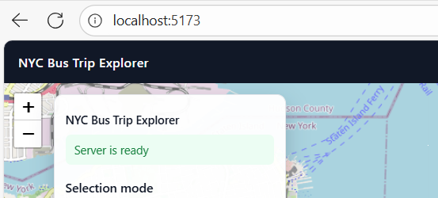

Server not ready:

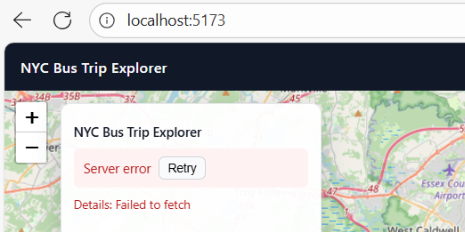

---

### TP-02 – Load vehicle reference list

**Objective:** Verify that the vehicle reference list is requested and displayed.

**User Stories:** US-02

**Preconditions:**

- Backend running and `/ready` returns `{"status":"Ready"}`.
- `/getVehRef` returns a non-empty JSON array of strings.

**Steps:**

1. Open the SPA and confirm it passes the readiness check.
2. Open dev tools → Network.
3. Locate the request to `/getVehRef`.
4. Observe the “Vehicle” selection control in the UI.

**Expected Result:**

- A single `GET /getVehRef` request is made and returns `200 OK`.
- The JSON response is an array of strings.
- The “Vehicle” dropdown displays one option per string in the response.
- If at least one entry is present, the first entry is selected by default.

**Screenshot:**

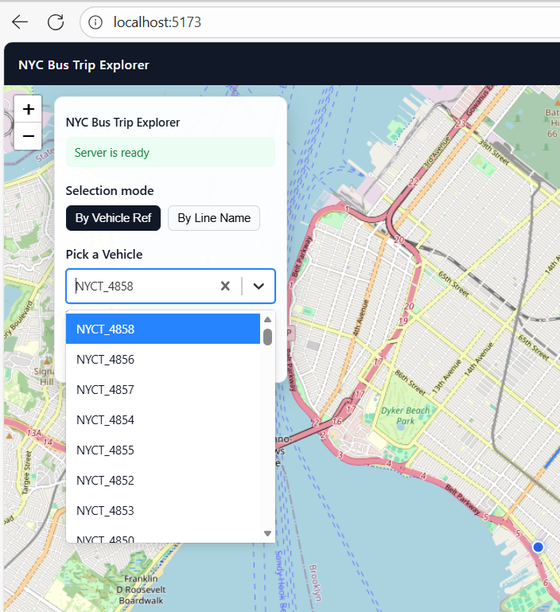

---

### TP-03 – Load public line names list

**Objective:** Verify that the line names list is requested and displayed.

**User Stories:** US-03

**Preconditions:**

- Backend running and ready.
- `/getPubLineName` returns a non-empty array of strings.

**Steps:**

1. Open the SPA and ensure it passes readiness.
2. Open dev tools → Network.
3. Locate the `/getPubLineName` request.
4. Observe the “Line” selection control.

**Expected Result:**

- `GET /getPubLineName` is called once and returns `200 OK`.
- The response is a JSON array of strings.
- The “Line” selector is populated with these names.
- If non-empty, the first entry is selected by default

**Screenshot:**

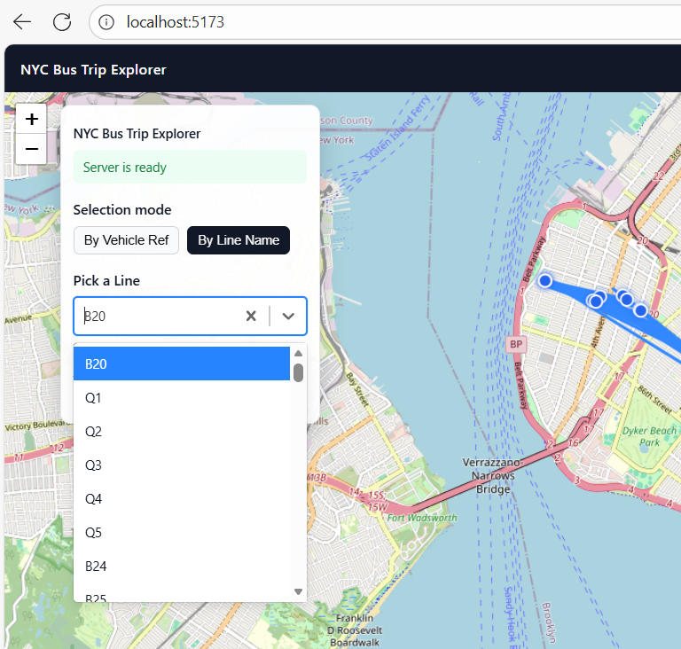

---

### TP-04 – Switch between Vehicle and Line modes

**Objective:** Verify correct behaviour when switching between modes.

**User Stories:** US-05, US-06, US-07

**Preconditions:**

- Backend ready; lists for both vehicles and lines are loaded correctly.

**Steps:**

1. Identify the mode toggle (e.g. radio buttons or buttons for “Vehicle” and “Line”).
2. Switch from “Vehicle” mode to “Line” mode.
3. Observe which controls are enabled/disabled.
4. Switch back from “Line” to “Vehicle” mode.

**Expected Result:**

- In “Vehicle” mode:
  - Vehicle selector is enabled/visible.
  - Line selector is disabled or visually de-emphasised.
- In “Line” mode:
  - Line selector is enabled/visible.
  - Vehicle selector is disabled or visually de-emphasised.
- No errors or crashes occur while toggling.
- Map content is updated to reflect the current selection.

---

### TP-05 – View trip for selected vehicle

**Objective:** Verify that selecting a vehicle loads and displays its trip.

**User Stories:** US-06

**Preconditions:**

- Backend ready.
- `/getVehRef` returns at least one `vehRef` with valid trip data.

**Steps:**

1. Ensure the app has loaded successfully.
2. Ensure mode is set to “Vehicle”.
3. From the vehicle selector, choose a known valid `vehRef`.
4. Open dev tools → Network and observe the new request.
5. Wait for the response and observe the map.

**Expected Result:**

- The app issues `GET /getBusTripByVehRef/{vehRef}`.
- The response is a `200 OK` with a valid GeoJSON FeatureCollection.
- Existing trip display is cleared.
- The new trip geometry is drawn on the map.
- Map automatically pans/zooms to fully contain the trip path.

**Screenshot:**

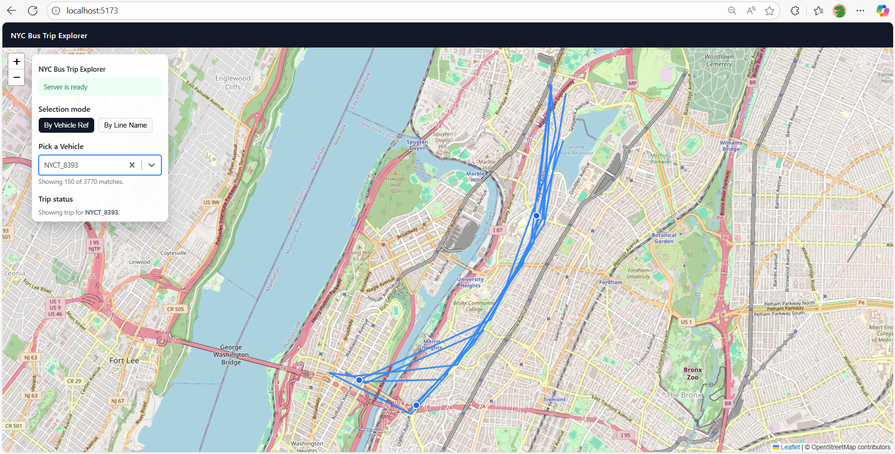

---

### TP-06 – Vehicle trip with empty or invalid geometry

**Objective:** Ensure the app handles empty or invalid trip responses for a vehicle.

**User Stories:** US-06

**Preconditions:**

- Turn off the wifi of the device to prevent it from receiving responses.

**Steps:**

1. Switch to “Vehicle” mode.
2. Select any `vehRef`.
3. Observe behaviour and the map.

**Expected Result:**

  - Map is cleared of previous data points.
  - Error message is shown based on the response text or generic status string.
  - No new map route is drawn.

**Screenshot:**

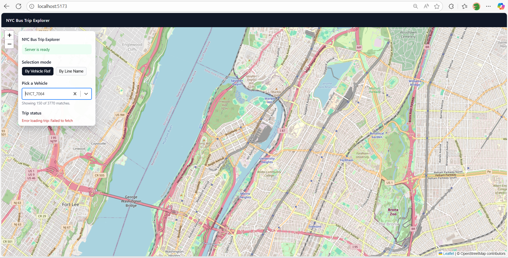

---

### TP-7 – View trip for selected line

**Objective:** Verify that selecting a line loads and displays its trip(s).

**User Stories:** US-07

**Preconditions:**

- Backend ready.
- `/getPubLineName` returns a line with valid trip data.

**Steps:**

1. Ensure the app has loaded successfully.
2. Switch to “Line” mode.
3. Select a known valid line (`pubLineName`) from the list.
4. Monitor the network call.
5. Observe the map rendering.

**Expected Result:**

- The app issues `GET /getBusTripByPubLineName/{pubLineName}`.
- Response is `200 OK` with GeoJSON FeatureCollection.
- All returned features are rendered on the map.
- The map fits bounds to show all features (lines, multi-lines, etc).

**Screenshot:**

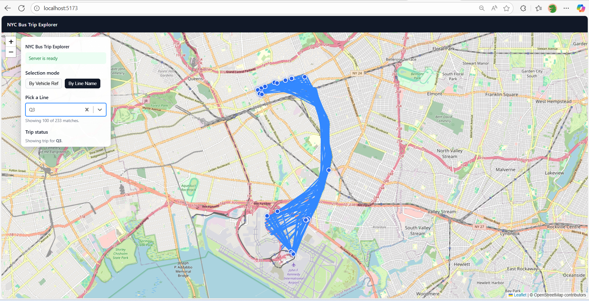

---

### TP-8 – Line trip error and empty result handling

**Objective:** Ensure the app handles empty or failed trip responses for a line.

**User Stories:** US-07

**Preconditions:**

- Turn off the wifi on the device.

**Steps:**

1. Switch to “Line” mode.
2. Select the configured line.
3. Observe the outcome.

**Expected Result:**

  - Map is cleared of previous data points.
  - An error message is displayed.
  - No new route is drawn on the map.

**Screenshot:**

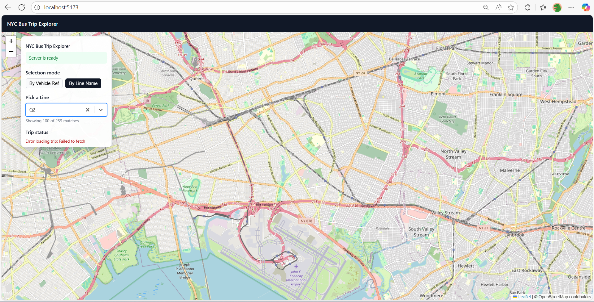
---

### TP-9 – Handle rapid selections and concurrent requests

**Objective:** Verify that only the most recent selection’s data is rendered if multiple requests overlap.

**User Stories:** US-10

**Preconditions:**

- Backend ready.
- Trips for multiple `vehRef` and `pubLineName` exist.

**Steps:**

1. In “Vehicle” mode, quickly select several different `vehRef` values in rapid succession.
2. Monitor network requests and their completion order.
3. Repeat the same test in “Line” mode with multiple `pubLineName` selections.

**Expected Result:**

- Multiple requests are in-flight and may complete out of order.
- The SPA renders only the trip corresponding to the **last** selection made by the user.
- Earlier, slower responses are ignored and do not overwrite the latest displayed route.

---

### TP-10 – Search for a specific vehicle

**Objective:** Verify search/filter behaviour in the vehicle selector.

**User Stories:** US-04

**Preconditions:**

- Backend ready.
- `/getVehRef` returns multiple distinct `vehRef` values with identifiable patterns (e.g. `MTA NYCT_1234`, `MTA NYCT_5678`, etc.).

**Steps:**

1. Ensure “Vehicle” mode is active and the list is loaded.
2. Focus the vehicle selector or associated search input.
3. Type a partial string that matches some but not all vehicle references (e.g. `883`).
4. Observe the list of options.
5. Select one of the filtered results.
6. Enter a random string that matches no lines (e.g. `asdfasf`).

**Expected Result:**

- Matching text filters the list to only relevant line names.
- Selecting a filtered line loads its trip normally (TP-5).
- For a query with no matches:
  - The UI shows the text `No options`.
  - No selection can be made.
- Clearing the search input restores the full line list.

**Screenshot:**

Search with valid options:

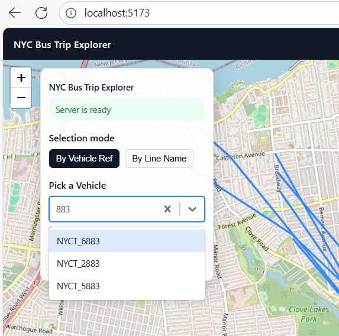

Search with no valid options:

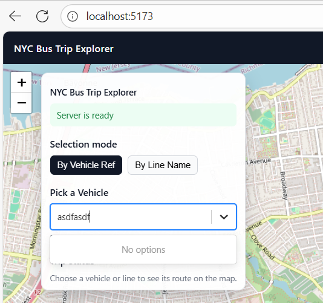

Cleared input:

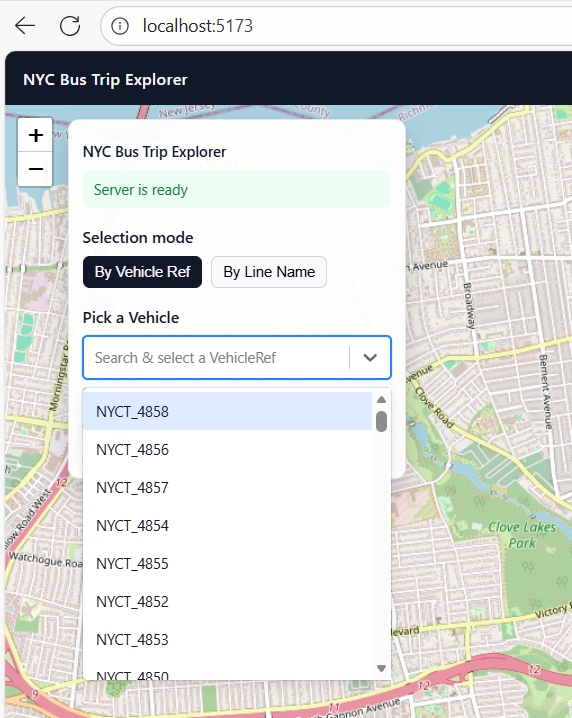

---

### TP-11 – Search for a specific line

**Objective:** Verify search/filter behaviour in the line selector.

**User Stories:** US-04

**Preconditions:**

- Backend ready.
- `/getPubLineName` returns multiple distinct line names (e.g. `M15`, `M15-SBS`, `BX12`, etc.).

**Steps:**

1. Switch to “Line” mode.
2. Focus the line selector or its search input.
3. Type partial text that matches some but not all lines (e.g. `67`).
4. Observe the filtered options.
5. Select a matching line and verify trip loading.
6. Enter a random string that matches no lines (e.g. `asdfasf`).

**Expected Result:**

- Matching text filters the list to only relevant line names.
- Selecting a filtered line loads its trip normally (TP-7).
- For a query with no matches:
  - The UI shows the text `No options`.
  - No selection can be made.
- Clearing the search input restores the full line list.

**Screenshot:**

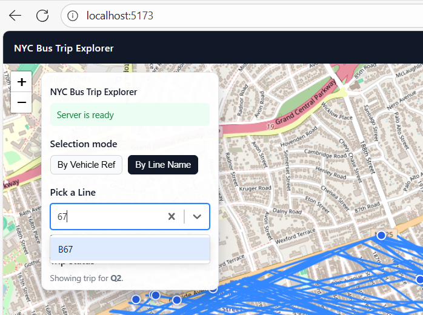

---

### TP-12 – Persist vehicle/line selection & mode across reloads

**Objective:** Ensure that the last selection and mode are preserved after reloading the page in the same browser.

**User Stories:** US-11

**Preconditions:**

- Backend ready.
- Browser storage (e.g. `localStorage`) is enabled.

**Steps:**

1. In “Vehicle” mode, select a specific `vehRef` and confirm its trip is displayed.
2. Reload the page (F5 or browser reload button).
3. Observe the mode and selected `vehRef`, and whether a trip is automatically loaded.
4. Switch to “Line” mode and select a line.
5. Confirm its trip is displayed.
6. Reload the page again.
7. Observe the mode and selection.

**Expected Result:**

- After the first reload:
  - The app starts in “Vehicle” mode.
  - The previously selected `vehRef` is pre-selected (assuming it still exists in the list).
  - Trip data for that `vehRef` is automatically requested and rendered.
- After the second reload (following line selection):
  - The app starts in “Line” mode.
  - The previously selected line is pre-selected (if still available).
  - The line’s trip data is automatically loaded.
- The user does not need to re-select their last choice after each reload.

---

## 6. Test Execution

- **Execution Order:**
  - Test TP-1 to TP-3 first to validate environment.
  - Then TP-4 to TP-12 in sequence.

---
